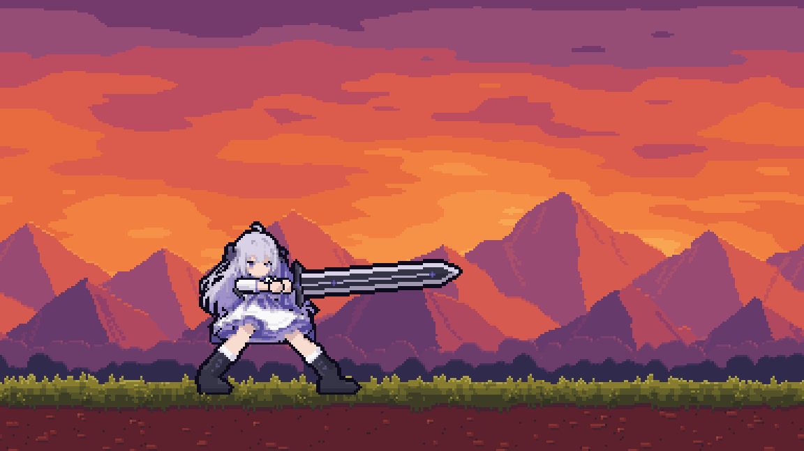

# Parry Perry

The game's main character is Max Perry. This repository (named Biboo, the project's earlier name)
holds her procedural pixel-art pipeline for a 11-frame greatsword chop in a sunset side-scroller scene.
One command rebuilds everything: the tileable background layers, the character sprite frames,
the effect overlays, a scene manifest for a game engine, and the preview GIFs.



## Quick start

Requires Python 3.10 or newer.

```
pip install -r requirements.txt
python -m swingkit
```

Output goes to `out/` (ignored by git). Build time is a few seconds. The command also runs the
consistency checks and exits non-zero if any fail.

Options:

```
python -m swingkit --out build/          # different output folder
python -m swingkit --scales 5 3 1        # GIF scales to write (5x = 1920x1080)
python -m swingkit --no-check            # skip the checks
```

Run the checks as tests:

```
pip install pytest
pytest
```

## Output

| Path | Contents |
|---|---|
| `swing_x3.gif`, `swing_x1.gif` | The looping animation, exact palette, no dithering |
| `frames/` | The 11 composited frames, 384x216 |
| `layers/` | `sky`, `mountains_far`, `mountains_near`, `trees_back`, `trees_front`, `ground`, `fringe`. Each is 384 wide and tiles seamlessly in x, with 8 margin rows above and below the view for camera shake |
| `character/` | 11 transparent sprite frames sharing one crop box and anchor, plus `char_sheet.png` |
| `fx_back/`, `fx_front/` | Per-frame effect overlays (smears behind the character; glint, flash, dust, debris in front) |
| `scene_manifest.json` | Layer order and parallax factors, ground line, sprite anchor, per-frame timing, sword angle and camera shake |
| `contact_sheet.png` | All frames at a glance |

Draw order back to front: sky, mountains_far, mountains_near, trees_back, trees_front, ground,
fx_back, character, fx_front, fringe. The fringe (tall grass) sits in front of the character's feet.

## The animation

Everything is drawn at one pixel scale. Limbs and the sword are redrawn every frame from fixed
measurements, never scaled, so proportions stay identical.

| Frame | Name | ms | What happens |
|---|---|---|---|
| 1 | plow | 320 | Plow guard (Pflug): hands low at the hip, blade angled up at the opponent's face, knees bent |
| 2-3 | raise1, raise2 | 90, 80 | Both hands lift the sword past vertical; weight rocks back, front foot lifts, eyes look up |
| 4 | high | 250 | High guard: fists above and in front of the forehead, blade up and back at 45 degrees, glint |
| 5 | impact | 120 | Low point: shoulder, straight arm and blade in one line, blade buried; motion blur trails the blade from the high guard (a stepped crescent with speed streaks); front foot stomps 4 px forward, flash, dirt crown, camera shake |
| 6 | impactbw | 60 | Anime-style impact frame: black and white, dense speed lines converging on the cut, black silhouette with white linework, white starburst |
| 7 | burst | 90 | Same pose; the first dust cloud erupts from the cut, shake rebounds |
| 8-9 | plume, settle | 100, 120 | Dust plume and debris come down; body stays braced low on the buried blade, shake decays |
| 10-11 | return1, return2 | 110, 130 | Blade pulled free, front foot steps back, ease into plow (frame 1) |

Techniques: the fast part of the swing is carried by motion blur on the impact frame and a black-and-white impact frame instead of in-between poses;
the hands go over the head in the high guard and the arms straighten into a full forward extension on
the way down. The rear hand holds the base of the handle, just above the pommel, in every frame
(`anim.REAR_HAND`, `anim.GRIP_SPAN`), with the lead hand up the grip by `anim.GRIP_GAP` (below the guard in plow and the strike).
Arms are two fixed-length segments (`anim.ARM_LEN`) that bend at the elbow. The head is drawn in
its own pass, so the lead arm goes behind the head and the rear arm in front of it; the blade and
guard never cover the face. Legs are two fixed-length
segments solved by inverse kinematics, so the hips can drop and the knees bend without changing
leg length; the front foot steps and stomps while planted feet are checked to stay on the ground.
The torso leans row by row and bends at the waist (`bend` in `HIPS`, rotated with a RotSprite-style
resample) while the head moves as one rigid piece (the face is never sheared or rotated).
The skirt hem lifts, trails, flares and bounces; the long hair sways and lifts with lag. Debris and
dust use simple deterministic physics; camera shake moves distant layers less.

Per-frame motion tables live in `swingkit/anim.py`: `HIPS` (hip offset, lean and waist bend), `FEET` (front
foot), `REAR_HEEL_UP`, `CLOTH` (skirt hem), `HAIR` (sway and lift), `GAZE` (eye direction) and
`SHOULDERS` (shoulder drive and sleeve squash). Frames are always looked up by name
(`anim.by_name`), never by index. Each boot foot is drawn together with its shin as one shape
(`rig._foot_mask`), so the ankle is continuous; both feet point toward the strike.

## Move library

Every other move the character has lives in `swingkit/moves/` and is built with the main
animation (`python -m swingkit`; add `--no-moves` to skip it). Each move writes composited preview
frames, transparent sprites on one shared anchor, a sprite sheet and a 2x GIF to
`out/moves/<id>/`. `out/moves/moves.json` holds the game data for all of them: frame timing, root
motion (how far the character travels, y up), hitbox capsules on active frames, loop points and the
input. `game/input_map.json` maps the Dreamcast pad to the moves ('+' = pressed together, '-' = in
sequence) with chord, sequence and tap windows. Previews of every move are in `docs/moves/`.

| Input | Move | Notes |
|---|---|---|
| none | idle | Plow guard, breathing loop |
| Right / Left (hold) | walk_right / walk_left | Shuffle steps in guard, 10 px per cycle |
| Down (hold) | duck | Crouch, holds |
| Up (hold) | charge | Rises into the high guard, blue aura loop; press A for the heavy chop |
| B hold / tap | block / parry | Upright sword; tap gives a spark parry window |
| Y | jump | Two body heights (164 px) |
| X | dash | 92 px, afterimages and speed lines |
| A | slash | Horizontal slash, flat crescent smear |
| Up-A | heavy | The main chop animation above; tap Up then A, or hold Up and press A |
| Right+A | thrust | Lunging thrust, 18 px forward |
| Down+A | upswing | Duck, then rising cut |
| Left+A | backstep_upswing | Rising cut while hopping 36 px back |
| L | push_kick | One cock-back frame with the sword raised out of the way, then a straight-leg push that slides her 49 px so the boot passes where the blade tip was; recoil |
| R (hold) | recover | Kneel on the planted sword, green glow, rising + signs |
| A+B | energy_slash | Slash with glittering blue energy; press A and B together, or hold B and tap A |
| B+L / A+B+L | heavy_kick / energy_kick | Bigger push kick; with blue energy (A, B and L together, or one after another in any order) |
| L+R | energy_burst | Ring and rays in all directions |
| X+Y | taunt | Plants the sword and beckons |
| X+A | dash_thrust | Blurred dash into the thrust |
| A (in the air) | jump_crash | Crash down into the heavy impact from wherever she is in the air (a jump, or falling after the sky dash); no second jump |
| Down-Y | sky_dash | Rises 6 body lengths (492 px); tap Down then Y, or hold Down and press Y |
| Left-Right-A | spin_attack | Two turns with a ring smear |
| B-X+A | energy_dash_thrust | Dash thrust with blue energy; tap or hold B, then press X and A together |
| Down-Right-A-B | energy_wave | Upswing that launches a large energy crescent |
| Down x4, A | earthquake | Slam, cracks and rocks along the ground, heavy shake |
| Up x4, A | meteor_shower | Sword to the sky, meteors rain ahead |

Moves are written as short pose specs (only what differs from the plow guard) in
`swingkit/moves/`; `base.frame()` turns them into rig frames, `base.tween()` makes in-betweens and
`base.fit()` pulls the grip into reach. Effects are in `swingkit/movefx.py`, the compositor
(root motion, follow camera, afterimages) in `swingkit/movekit.py`. The `moves` check keeps every
move on the rig rules (fixed limb lengths, planted feet, grip, draw order, face clear).

## Web game

`web/index.html` plays the move library live. Open the file in a browser (no server needed) and
use the Dreamcast inputs from the table above:

| Pad | Keyboard | Gamepad |
|---|---|---|
| Up / Down / Left / Right | arrow keys | d-pad or left stick |
| A / B / X / Y | Z / X / C / V | bottom / right / left / top face button |
| L / R | Q / W | shoulders or triggers |

The heavy chop shows its black-and-white impact frame and shakes the camera only after a full
2 second charge (Up held); a quicker chop keeps the dirt plume but skips both. The crash (A in the
air) gets them only when it starts more than two body lengths (164 px) up, so from the sky dash but
not from a normal jump. Walking and the plain dash stop at enemies instead of passing through.

Gamepads, wired or Bluetooth (including on an Android phone in Chrome), come through the browser's
Gamepad API with the standard layout. A pad shows up after one of its buttons is pressed; its name
is shown under the pad chips. Pads without the standard layout also get their d-pad read from axes 6-7.
Android can also send a pad's d-pad as arrow-key events (sometimes with no key code); those are read
too, and a direction held on either path stays held while other buttons are pressed. The input
monitor under the page lists every raw key and controller event, for checking what a pad sends.

`web/input.js` reads `game/input_map.json` exactly: holds loop while held, B is parry when tapped
(up to `tap_max_ms`) and block when held, chords need their face and shoulder buttons within
`chord_window_ms` (directions only need to be held, so hold Right and press A for the thrust; A+B
also fires when B is held and A is tapped; A+B+L also takes its buttons one after another), and
sequences need each press within `sequence_window_ms` of the last. In a two-step sequence that
starts with a direction or a hold button (Up-A for the heavy chop, Down-Y for the sky dash, B-X+A
for the energy dash thrust), holding that button counts the same as tapping it. A step can be a
chord: B-X+A is B, then X and A together. The longest sequence wins, then the largest chord, then a single
button. A plain press made during another attack waits for it to finish; chords, sequences and taps
cut in. A move that ends in the air (the sky dash) falls back down and lands.

The assets in `web/assets/` are generated: each move frame is one image with the effects and the
character, drawn around the character so the game can place it anywhere in the scrolling scene.
Rebuild them after changing a move:

```
python -m swingkit --web
```

### Enemies (combat test)

A goblin and an orc walk in from the right and attack when they get close. Any attack of hers that
touches one kills it at once (HP comes later). When one of theirs reaches her:

- Hit: she turns red and is knocked back (goblin 40 px, orc 64 px). She is stunned in the raised
  sword pose, with no control, until the push stops, and cannot be hit again for 0.4 s after.
- Blocking (holding B): she flashes white and slides back 8 px. No stun; she keeps blocking.
- Parry (tap B): if her parry frames 1-3 are showing while the attack is up to two frames from
  hitting her, or on its first hitting frame before the hit lands, the enemy turns white, is pushed back (goblin 50 px, orc 40 px)
  and is stunned until the push stops. She takes nothing.

An enemy hit lands 90 ms after its hitting frame first touches her hurtbox (about one enemy frame),
which leaves time to parry the swing as it appears. Her hurtbox reaches the top of her body on each
frame (81 px standing) and stops 5 px under her head while ducking (69 px). The orc is drawn at 5x,
so its swing (70-110 px up) hits her standing but passes over her duck.

Enemy attack areas are the weapon and smear in front of the body on hand-picked frames (goblin 20,
21, 24, 25, 31, 32, 39-41, and 47-49 for the green spin all round; orc 27-28). Press H in the game to
show hurtboxes (yellow enemies, blue her), her attack shapes (red) and enemy attack areas (orange).

`swingkit/enemies.py` builds them from the packed GIFs in `data/enemies/`: it samples each GIF down
to native pixels, keys out the background (the goblin's shadow and the orc's sword smear become
translucent), flips the art to face left, scales it (goblin x2, orc x5) and splits it into
animations:

| Enemy | Animation | GIF frames | Use |
|---|---|---|---|
| goblin | idle | 0-5 | resting between attacks |
| goblin | walk | 0-5 | approach (the sheet has no walk cycle, so it slides in its ready stance) |
| goblin | slash | 18-27 | spin slash into a lunge, when close |
| goblin | dive | 27-35 | dive roll attack, from mid range (110-170 px) |
| goblin | combo | 35-50 | combo attack (leap, air slashes, green spin), when close |
| orc | idle | 0-3 | resting between attacks |
| orc | walk | 8-15 | approach |
| orc | attack | 25-31 | overhead swing |
| orc | hurt | 49-50 | exported, not used yet |
| orc | death | 57-60 | played when killed |

Every attack returns to idle. The goblin's art moves inside its frames during the dive roll and the
combo; each frame stores its ground offset, so the goblin stays where an attack leaves it. Goblin
frames 51-68 are not used. The goblin has no death animation, so it flickers and fades out.

Her hit shapes are exported per frame in `data.js`: the blade capsule (guard to tip) or the kicking
foot on active frames, plus the energy that hits: the burst ring, the earthquake crack along the
ground, the flying energy wave and landing meteors. The parry never hits. The two upswings also hit along the arc the blade swings through (from behind her, under and up through the front) on their first hit frame.

Tests: `node web/tests/input.test.js` drives every binding through the input reader (also run by
`pytest`), and `NODE_PATH=$(npm root -g) node web/tests/browser.test.js` presses real keys in
headless Chromium and checks that each binding starts its move and that attacks kill enemies in reach (needs Playwright).

## Project layout

```
swingkit/
  bg.py         background layers (sky, mountains, trees, ground, fringe), all periodic in x
  rig.py        character rig: body layers, IK legs, skirt cloth, hair bending, arms, fists, sword
  anim.py       the 12 pose specifications and the character renderer
  fx.py         smears, glint, impact flash, dirt crown, mound, debris, dust cloud
  composite.py  frame assembly with parallax camera shake
  gifwrite.py   exact-palette GIF writer and verifier
  build.py      writes every deliverable
  webexport.py  assets for the browser game (web/)
  enemies.py    enemy sprites for the browser game, cut from data/enemies/*.gif
  checks.py     frame count, arm and leg lengths, planted feet, occlusion, tiling, GIF fidelity
data/
  pal.npy       20-colour character palette
  body_old.npy  character body (no arms or sword), 128x82 palette indices
docs/           preview GIF and sprite sheet
tests/          pytest wrapper around checks.py and the web input tests
web/            browser game: index.html, game.js, input.js, generated assets/
```

## Changing things

- Poses and timing: edit `FRAMES` in `swingkit/anim.py`. Each frame sets the sword angle, hand
  positions, arm routing, body offsets, hair sway, draw order and duration. The checks flag arms
  that stretch or shrink, a lead arm drawn in front of the head, and any blade or guard pixel over
  the face.
- Effects: particle counts, speeds, gravity and colours are at the top of the particle section in
  `swingkit/fx.py`. All randomness is seeded, so builds are reproducible.
- Scene: peak positions, colours and seeds live in `swingkit/bg.py`. Placement of the character in
  the demo scene is `X0, Y0` in `swingkit/fx.py`.

## Background art

The scene is original pixel art generated by `bg.py`. It was inspired by a reference image that was
a watermarked stock preview, which is not used or included. If you license a background of your
own, replace the files in `out/layers/` (or change `bg.build_all`) and keep the same layer names,
width and margin rows.
